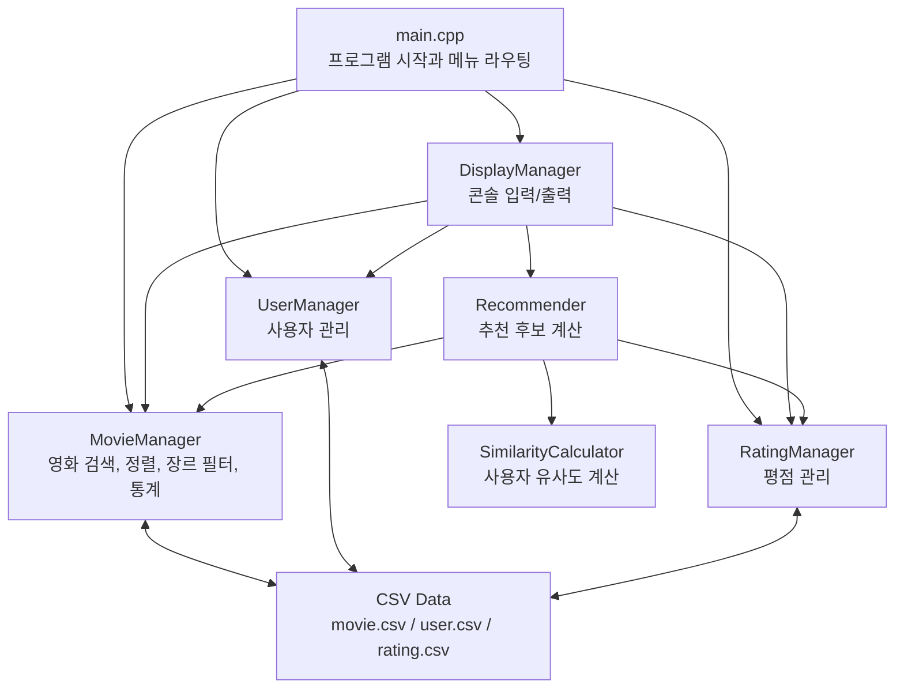

<div align="center">

# Movie Recommender

사용자 평점 데이터를 기반으로 영화를 추천하는 C++17 콘솔 애플리케이션


</div>

## Overview

Movie Recommender는 영화, 사용자, 평점 데이터를 CSV 파일로 관리하고, 사용자 간 평점 유사도를 계산해 아직 보지 않은 영화를 추천하는 C++ 콘솔 프로그램입니다.

M3까지 구현한 추천 시스템 위에 M4 발표용 확장 기능으로 `장르 필터 추천`과 `통계 기능`을 추가했습니다. 기능은 매니저 계층과 화면 입출력 계층을 분리해 유지보수하기 쉽게 구성했습니다.

## Highlights

| Category | Feature |
| --- | --- |
| Movie | 영화 추가, 제목 검색, 전체 목록 출력, 평점순 정렬 |
| User | 사용자 추가, 사용자 목록 출력 |
| Rating | 평점 입력, 기존 평점 수정, 영화별 평점 조회 |
| Recommendation | 유사 사용자 기반 영화 추천 |
| Extension | 장르 필터 추천, 전체/장르별/Top N 통계, 콘솔 UI/UX 개선 |
| Reliability | CSV 파일 I/O 예외 처리, 손상 라인 건너뛰기, 입력 검증 |

## Quick Start

### Requirements

- C++17을 지원하는 컴파일러
- `make`

### Build

```bash
make
```

### Run

```bash
make run
```

또는 실행 파일을 직접 실행할 수 있습니다.

```bash
./movie_recommender
```

프로그램은 실행 시 `data/movie.csv`, `data/user.csv`, `data/rating.csv`를 읽고, 종료 시 현재 데이터를 같은 파일에 저장합니다.

## Menu

```text
==============================================================
Movie Recommender
--------------------------------------------------------------
현재 데이터  영화 20편 | 사용자 10명 | 평점 80건
--------------------------------------------------------------

[영화]
  1. 영화 추가
  2. 제목으로 검색
  3. 전체 목록 출력
  4. 평점순 정렬 출력

[사용자]
  5. 사용자 추가
  6. 사용자 목록 출력

[평점]
  7. 평점 입력
  8. 영화별 평점 보기

[추천]
  9. 사용자별 영화 추천
10. 장르 필터 추천

[통계]
11. 통계 보기

  0. 종료
==============================================================
```

## Demo Scenario

발표 시에는 아래 입력 흐름을 그대로 사용하면 기존 추천, 확장 기능, 통계를 한 번에 보여줄 수 있습니다.

```text
9
1
10
1
액션
11
1
2
3
5
0
0
```

시연 포인트:

- 사용자 `1`에게 추천되는 기본 Top 5 결과
- 같은 사용자에게 `액션` 장르만 필터링한 추천 결과
- 전체 평균 평점, 장르별 평균 평점, 평점 Top 5 영화

## Architecture



## Class Responsibilities

| Class | Responsibility |
| --- | --- |
| `Movie` | 영화 ID, 제목, 장르, 개봉 연도, 평균 평점, 평점 수 관리 |
| `User` | 사용자 ID, 이름, 이메일 관리 |
| `Rating` | 사용자 ID, 영화 ID, 평점 점수 관리 |
| `BaseManager` | CSV load/save와 size를 위한 공통 인터페이스 |
| `MovieManager` | 영화 추가, 검색, 정렬, 장르 필터, 평점 재계산, 통계 계산 |
| `UserManager` | 사용자 추가, 검색, 목록 출력, CSV 입출력 |
| `RatingManager` | 평점 추가/수정, 사용자별/영화별 평점 조회, CSV 입출력 |
| `SimilarityCalculator` | 두 사용자의 공통 영화 평점 차이 기반 유사도 계산 |
| `Recommender` | 유사 사용자 기반 추천 점수 계산 및 추천 결과 정렬 |
| `DisplayManager` | 메뉴별 사용자 입력 검증과 결과 출력 |

## Recommendation Algorithm

추천은 사용자 기반 협업 필터링 방식으로 동작합니다.

1. 추천받을 사용자의 평점 목록을 찾습니다.
2. 다른 사용자와 공통으로 평가한 영화를 비교합니다.
3. 공통 영화 수와 평점 차이를 이용해 유사도를 계산합니다.
4. 유사도가 높은 사용자들이 높게 평가한 영화 중, 대상 사용자가 아직 평가하지 않은 영화를 후보로 모읍니다.
5. 추천 점수 기준 내림차순으로 정렬하고 Top N개를 출력합니다.

유사도 계산식:

```text
similarity = commonMovieCount * COMMON_MOVIE_WEIGHT - scoreDiffSum
```

추천 점수 계산식:

```text
recommendScore[movieId] += otherUserRating * similarity
```

기본 설정은 [include/MovieConstants.h](include/MovieConstants.h)에 정리되어 있습니다.

## Extensions

### Genre Filter

메뉴 `10. 장르 필터 추천`에서 사용자 ID와 장르를 입력하면 해당 장르의 추천 결과만 출력합니다.

```text
10
1
액션
```

구현 포인트:

- `MovieManager::filterMoviesByGenre`에서 `std::copy_if`와 람다를 사용합니다.
- `Recommender::recommend`는 선택 장르 인자를 받아 기존 추천 로직과 호환됩니다.
- 기존 메뉴 `9. 사용자별 영화 추천`은 그대로 유지됩니다.

### Statistics

메뉴 `11. 통계 보기`에서 다음 항목을 확인할 수 있습니다.

| Submenu | Output |
| --- | --- |
| `1. 전체 평균 평점` | 전체 평점 평균과 전체 평점 수 |
| `2. 장르별 통계` | 장르별 영화 수, 평점 수, 평균 평점, 인기 장르 |
| `3. 평점 Top N 영화` | 원하는 개수만큼 평균 평점 상위 영화 출력 |

구현 포인트:

- `std::accumulate`로 전체 평균 평점을 계산합니다.
- `std::map`과 구조적 바인딩으로 장르별 통계를 계산합니다.
- `std::sort`와 람다로 Top N 영화를 정렬합니다.
- 평점이 없는 데이터는 예외 또는 안내 메시지로 처리합니다.

### UI/UX

콘솔 화면을 M4 발표 시연에 맞게 정리했습니다.

구현 포인트:

- 메인 메뉴 상단에 현재 영화/사용자/평점 수를 표시합니다.
- 메뉴와 결과 화면을 구분선과 섹션 제목으로 분리했습니다.
- 성공, 안내, 확인 메시지를 `[완료]`, `[안내]`, `[확인]` 형식으로 통일했습니다.
- 장르 필터 추천 전에 사용 가능한 장르 목록과 영화 수를 보여줍니다.
- 평균 평점, 평점 점수, 추천 점수를 소수점 둘째 자리로 통일했습니다.

## M4 Presentation Pack

발표와 시연에 필요한 산출물을 함께 정리했습니다.

| Artifact | Purpose |
| --- | --- |
| [발표 슬라이드](presentation/movie-recommender-m4.pptx) | 10분 발표용 PPTX |
| [발표 구성안](docs/presentation-plan.md) | 시간대별 발표 흐름, 클래스 다이어그램, 데이터 흐름 |
| [시연 시나리오](docs/demo-scenario.md) | 실행 순서, 고정 입력값, 발표 멘트 |
| [예상 Q&A](docs/qna.md) | 캡슐화, STL, 예외 처리, 추천 알고리즘 답변 |
| [코드 리뷰 기록](docs/code-review.md) | 자가 리뷰, 품질 개선, 검증 결과 |
| [최종 체크리스트](docs/final-checklist.md) | M4 제출 전 확인 항목 |

## Data Format

### `data/movie.csv`

필드 순서: `id,title,genre,releaseYear`

```csv
1,기생충,드라마,2019
```

### `data/user.csv`

필드 순서: `id,name,email`

```csv
1,김민준,minjun.kim@example.com
```

### `data/rating.csv`

필드 순서: `userId,movieId,score`

```csv
1,1,5
```

현재 시연 데이터:

| File | Count |
| --- | ---: |
| `data/user.csv` | 10 users |
| `data/movie.csv` | 20 movies |
| `data/rating.csv` | 80 ratings |

## Quality & Reliability

검증한 항목:

- `make` 빌드 성공
- 메뉴 `1`부터 `11`까지 임시 데이터로 전체 리허설 성공
- 추천 알고리즘과 장르 필터 추천 출력 확인
- 전체 평균, 장르별 통계, Top N 통계 출력 확인
- 개선된 콘솔 메뉴, 장르 선택 힌트, 점수 포맷 확인
- CSV 파일 누락 시 초기 로딩 실패 메시지와 비정상 종료 확인
- 손상된 CSV 라인은 건너뛰고 정상 라인으로 프로그램 실행 확인

코드 품질 포인트:

- 기능 계산은 `MovieManager`, `RatingManager`, `Recommender`에 배치하고 화면 입출력은 `DisplayManager`에 분리했습니다.
- `const` 멤버 함수와 `const&` 인자를 사용해 불필요한 변경과 복사를 줄였습니다.
- `std::unique_ptr<Movie>`를 사용해 영화 객체 주소 안정성과 메모리 관리를 유지합니다.
- `std::copy_if`, `std::accumulate`, `std::sort`, `std::map`, 람다, 구조적 바인딩을 활용했습니다.
- 파일 I/O 실패는 예외로 처리하고, 잘못된 CSV 라인은 줄 번호와 함께 건너뜁니다.

## Git Workflow

새 기능은 강의 자료의 흐름대로 기능 브랜치에서 작업한 뒤 main에 머지했습니다.

```text
main
├── feature/genre-filter
├── feature/statistics
└── feature/ui
```

완료된 기능 브랜치:

- `feature/genre-filter`
- `feature/statistics`
- `feature/ui`

README와 발표 문서 정리는 필요할 때 main에서 바로 업데이트합니다.

## Project Structure

```text
.
├── data/
│   ├── movie.csv
│   ├── rating.csv
│   └── user.csv
├── docs/
│   ├── code-review.md
│   ├── demo-scenario.md
│   ├── final-checklist.md
│   ├── presentation-plan.md
│   └── qna.md
├── include/
│   ├── BaseManager.h
│   ├── DisplayManager.h
│   ├── Movie.h
│   ├── MovieConstants.h
│   ├── MovieManager.h
│   ├── Rating.h
│   ├── RatingManager.h
│   ├── Recommender.h
│   ├── SimilarityCalculator.h
│   ├── User.h
│   └── UserManager.h
├── src/
│   ├── DisplayManager.cpp
│   ├── Movie.cpp
│   ├── MovieManager.cpp
│   ├── Rating.cpp
│   ├── RatingManager.cpp
│   ├── Recommender.cpp
│   ├── SimilarityCalculator.cpp
│   ├── User.cpp
│   ├── UserManager.cpp
│   └── main.cpp
├── presentation/
│   └── movie-recommender-m4.pptx
├── Makefile
└── README.md
```

## Author

| Name | Role |
| --- | --- |
| Jaemin Lee | Project owner, C++ implementation, recommendation logic, extension features, M4 presentation preparation |

## License

This project is prepared for CSE2150 C++ Programming coursework.
