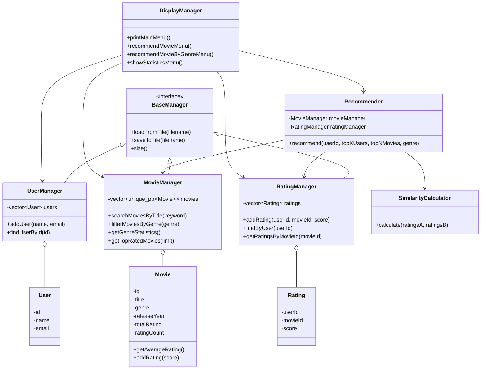
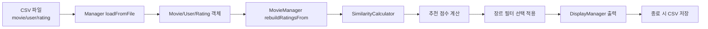

# M4 발표 구성안

## 10분 발표 타임라인

| Time | Section | Key Message |
| --- | --- | --- |
| 0:00-0:30 | 인사 및 팀 소개 | 영화 추천 시스템을 C++ 객체지향 구조로 구현했다 |
| 0:30-1:30 | 프로젝트 개요 | CSV 데이터 기반으로 사용자 평점 유사도를 계산해 영화를 추천한다 |
| 1:30-3:30 | 시스템 아키텍처 | `Movie`, `User`, `Rating`, Manager, Recommender가 역할을 나눠 동작한다 |
| 3:30-6:30 | 핵심 기능 시연 | 사용자 1번 추천, 장르 필터 추천, 통계 메뉴를 실제 실행한다 |
| 6:30-8:30 | 기술적 도전과 해결 | 포인터 안정성, CSV 예외 처리, 추천 로직 분리, UI/UX 정리를 설명한다 |
| 8:30-9:30 | 확장 기능 | 장르 필터, 통계, 콘솔 UI 개선으로 M4 확장성을 보여준다 |
| 9:30-10:00 | Q&A 유도 | 예상 질문 키워드와 개선 방향을 짧게 언급하고 질문을 받는다 |

## 한 줄 프로젝트 소개

> Movie Recommender는 CSV로 관리되는 영화/사용자/평점 데이터를 기반으로 사용자 간 유사도를 계산해 아직 보지 않은 영화를 추천하는 C++17 콘솔 애플리케이션입니다.

## 시스템 아키텍처 설명

## 데이터 흐름

## 숫자 기반 설명

- 시연 데이터: 사용자 `10명`, 영화 `20편`, 평점 `80건`
- 전체 평균 평점: `4.36`
- 인기 장르: `드라마`, 평점 `18건`
- 사용자 `1` 기본 추천 1위: `밀수`, 추천 점수 `474.75`
- 사용자 `1` 액션 추천: `암살`, `범죄도시`, `베테랑`
- Top 5 영화: `듄`, `서울의 봄`, `범죄도시`, `헤어질 결심`, `극한직업`

## 기술적 도전과 해결

| Challenge | Solution |
| --- | --- |
| 영화 객체 주소 안정성 | `std::unique_ptr<Movie>`로 객체를 보관해 포인터 안정성과 메모리 관리를 확보 |
| CSV 파일 손상 | 잘못된 라인은 줄 번호와 함께 건너뛰고 정상 라인은 계속 로딩 |
| 추천 로직 복잡도 | 유사도 계산, 후보 점수 계산, 정렬, 결과 변환을 함수로 분리 |
| 기존 기능 보존 | `recommend`에 기본 장르 인자 `""`를 두어 기존 추천 호출과 호환 |
| 발표 시 화면 가독성 | 메뉴 구분선, 데이터 수 표시, 장르 목록 힌트, 점수 포맷 통일 |

## 본인 기여도 정리

- `Recommender` 기반 추천 흐름 정리
- 장르 필터 추천 기능 구현
- 통계 기능 구현
- 콘솔 UI/UX 개선
- CSV 예외 처리와 파일 I/O 검증
- README, 시연 시나리오, Q&A, 발표 자료 정리
